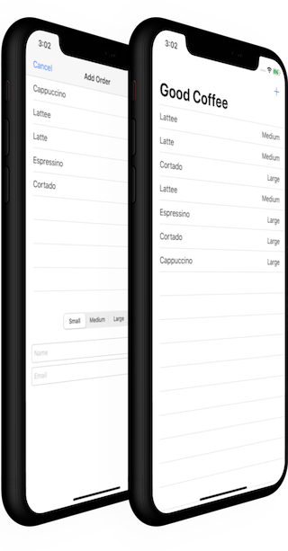

# Good Coffee (UIKit)

## Description

A basic coffee order app using `MVVM`, this application is not using any database, but it is using a service to get the coffee orders and to add new ones, it is a simple service hosted on [Heroku](https://guarded-retreat-82533.herokuapp.com/).

